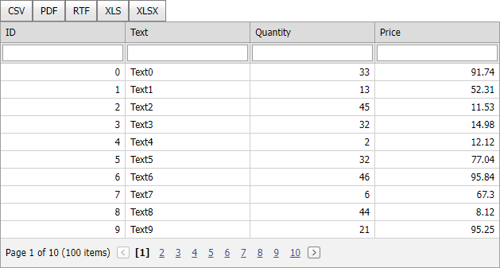

<!-- default badges list -->

[](https://supportcenter.devexpress.com/ticket/details/E3898)
[](https://docs.devexpress.com/GeneralInformation/403183)
<!-- default badges end -->

# Grid View for ASP.NET MVC - How to export grid data to different formats

This example illustrates how to use the [ExportTo*](https://docs.devexpress.com/AspNetMvc/DevExpress.Web.Mvc.GridViewExtension._methods?p=netframework) methods to export the GridView 's content in different formats.



Note the following key points when you export [GridView extension](https://docs.devexpress.com/AspNetMvc/8966/components/grid-view) content:

- Define the GridView extension in a separate PartialView ([TypedListDataBindingPartial.cshtml](./CS/Views/Home/TypedListDataBindingPartial.cshtml)) without any additional tags.
- Wrap the GridView's PartialView in a form to apply the client's layout state (sorting, filtering, etc.).
    ```
    @using(Html.BeginForm("ExportTo", "Home")) {
        // ...
        @Html.Partial("TypedListDataBindingPartial", Model)
    }
    ```
- Make a POST request to submit this form to the corresponding Controller Action.
- The [GridViewSettings](https://docs.devexpress.com/AspNetMvc/DevExpress.Web.Mvc.GridViewSettings) (especially the [Name](https://docs.devexpress.com/AspNetMvc/DevExpress.Web.Mvc.SettingsBase.Name) property) should be the same in PartialView and Controller;
- The data source/Model should be the same in PartialView and Controller.


## Files to Review

* [HomeController.cs](./CS/Controllers/HomeController.cs) (VB: [HomeController.vb](./VB/Controllers/HomeController.vb))
* [Index.cshtml](./CS/Views/Home/Index.cshtml) (VB: [Index.vbhtml](./VB/Views/Home/Index.cshtml))
